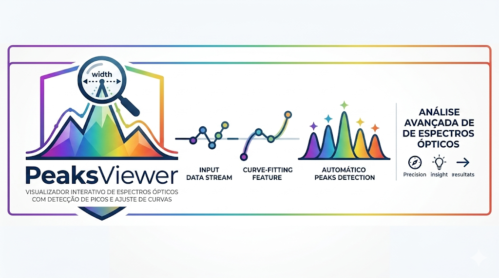

# PeaksViewer



Visualizador interativo de espectros ópticos com detecção de picos e ajuste de curvas, em Python (Tkinter + Matplotlib).

Permite carregar um ou vários arquivos de espectro (formato `wavelength;intensity`), navegar entre eles com o teclado e analisar picos, larguras (FWHM) e perfis Gaussianos/Lorentzianos.

## Funcionalidades

- **Carregamento múltiplo**: abra vários arquivos de uma vez e navegue entre eles.
- **Navegação por teclado**: `←` / `→`, `<` / `>`, `,` / `.`, `-` / `+`, `Page Up` / `Page Down`.
- **Detecção automática de picos** via `scipy.signal.find_peaks`, com prominência ajustável (filtra ruído).
- **Clique em pico** para selecioná-lo e copiar λ (comprimento de onda) ou I (intensidade) para a área de transferência.
- **Gradiente de cores**: preenchimento sob a curva colorido segundo o comprimento de onda (espectro visível 380–720 nm).
- **Escala em dB**: alterna entre intensidade linear e potência em dB (relativa ao máximo).
- **Ajuste de curva** Gaussiano ou Lorentziano com cálculo de:
  - Centro (λ₀)
  - Amplitude
  - FWHM (largura à meia altura)
  - R² (qualidade do ajuste)
- **Seleção de região** com o mouse (arrastar sobre o gráfico) para ajustar apenas um intervalo do espectro.

## Formato dos arquivos de entrada

Os arquivos são detectados automaticamente. Há dois formatos suportados:

### 1. Formato simples (`.txt` ou `.csv`)

Uma amostra por linha, separados por `;`:

```
6.5000000e-07;120.5
6.5010000e-07;125.2
6.5020000e-07;131.8
...
```

- **Coluna 1**: comprimento de onda em **metros** (~`1e-7`) **ou** em **nm** (~`100–3000`).
  A unidade é detectada pela magnitude — não é necessário converter manualmente.
- **Coluna 2**: intensidade (unidade arbitrária, linear).

### 2. Formato ThorLabs FTS (OSA203 e similares)

Arquivo CSV com cabeçalho `[SpectrumHeader]`, linhas de metadados `#Key;Value`
e bloco de dados após `[Data]`:

```
#Thorlabs FTS
[SpectrumHeader]
#Date;20260522
#XAxisUnit;nm_air
#YAxisUnit;dBm
#InstrModel;OSA203
...
[Data]
9.997433472e+02;-6.069665527e+01
9.997922363e+02;-6.210790634e+01
...
```

O leitor honra:

- `#XAxisUnit`: `nm_air`, `nm_vac`, `nm`, `m` (conversão automática para nm).
- `#YAxisUnit`: `dBm`, `dB`, `dBW` (mantém escala logarítmica) ou linear.

Quando a fonte está em dB, o eixo Y do gráfico é rotulado como **Potência (dBm)**
e o ajuste em escala log é tratado corretamente (sem aplicar `10·log10` duas vezes).
A opção **Potência (dB)** passa a normalizar ao pico (0 dB no máximo).

Linhas inválidas, em branco e seções desconhecidas são ignoradas silenciosamente.

## Instalação

Requer Python 3.8+ e as seguintes bibliotecas:

```bash
pip install numpy scipy matplotlib
```

> `tkinter` faz parte da biblioteca padrão do Python (no Windows e macOS já vem incluído; no Linux pode ser necessário instalar `python3-tk`).

## Uso

```bash
python peaks_viewer.py
```

1. Clique em **Carregar arquivo(s)...** e selecione um ou mais espectros.
2. Use os botões `< Anterior` / `Próximo >` ou as teclas de seta para navegar.
3. Marque **Exibir picos** para detectar picos automaticamente; ajuste a **Prominência** para filtrar ruído.
4. Marque **Gradiente de cores** para preencher a área sob a curva com as cores do espectro visível.
5. Marque **Potência (dB)** para visualizar em escala logarítmica.
6. Marque **Ajustar curva**, escolha **gaussian** ou **lorentzian** e, opcionalmente, arraste o mouse sobre o gráfico para restringir o ajuste a uma região.
7. Clique em um pico e use **Copiar λ** ou **Copiar I** para copiar os valores.

## Configurações persistentes

O botão **⚙ Configurações** no canto direito da barra abre um modal com três abas:

- **Interface**: mostra/oculta cada grupo de controles da barra (navegação,
  picos, gradiente, dB, ajuste de curva, prominência, botões de copiar).
  Aplicado imediatamente.
- **Comportamento**: estados iniciais ao abrir o programa (qual checkbox já
  vem ligado, qual modelo de ajuste padrão), e o auto-ativar de "Potência (dB)"
  quando dados em escala log são detectados.
- **Aparência**: tema escuro do gráfico e tamanho inicial da janela.

As preferências são gravadas em **`~/.peaksviewer/settings.json`** (Windows:
`C:\Users\<você>\.peaksviewer\settings.json`). O botão *Restaurar padrões*
volta o formulário aos valores de fábrica; *Salvar e aplicar* persiste e
aplica as mudanças vivas (visibilidade / tema / geometria) sem precisar
reiniciar.

Exemplo de `settings.json`:

```json
{
  "ui_visibility": {
    "navigation": true,
    "peaks": true,
    "gradient": false,
    "power_db": true,
    "fit_curve": true,
    "prominence": true,
    "copy_buttons": false
  },
  "defaults": {
    "show_peaks": true,
    "show_gradient": false,
    "show_power_db": false,
    "fit_curve_enabled": false,
    "fit_model": "lorentzian",
    "auto_enable_db_when_detected": true
  },
  "appearance": {
    "dark_theme": false,
    "window_geometry": "1024x600"
  }
}
```

## Atalhos de teclado

| Tecla                  | Ação              |
| ---------------------- | ----------------- |
| `←`, `<`, `,`, `-`, `Page Up`   | Espectro anterior |
| `→`, `>`, `.`, `+`, `Page Down` | Próximo espectro  |

## Estrutura

- `peaks_viewer.py` — aplicação completa (GUI, leitura de arquivos, detecção de picos, ajuste de curvas).

## Licença

Distribuído sob a [Licença MIT](LICENSE) © 2026 Jakson Almeida.
